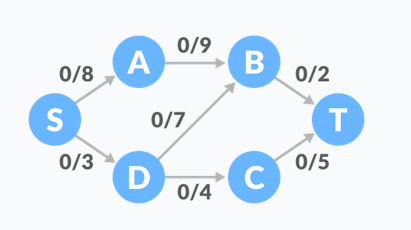
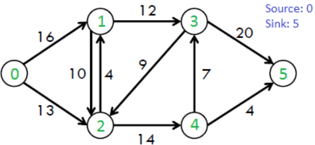

# [Ford-Fulkerson Algorithm](https://github.com/DAEHEE97/Ford-Fulkerson-Algorithm/blob/main/Ford%20Fulkerson%20Algorithm.ipynb)

The Ford–Fulkerson method 혹은 Ford–Fulkerson algorithm (FFA) 는 flow network 에서 최대 유량을 계산하는 그리디 알고리즘 입니다.

residual graph에서 augmenting paths를 찾는 접근법이 완전히 지정되지 않았으며, 혹은 어떻게 구현하냐 에따라 실행 시간이 다르기 때문에 알고리즘 대신 'Method' 라고 부르기도 합니다.

1956년 L. R. Ford Jr.와 D. R. Fulkerson.에 의해 출판되었습니다.

---

## Flow network 정의

- **Flow network** (유량 네트워크): edges에 source (S) 와  sink (T) 를 가진 정점들의 네트워크로 각각의 간선의 값은 비용이 아닌 **용량을 갖는 방향성 그래프** 입니다.
 

- **$c(u,v)$** : 정점 $u$ 에서 $v$ 로 갈 수 있는 / 남은 간성의 용량 ( capacity )

- **$f(u,v)$** : 정점 $u$ 에서 $v$ 로 실제 흐르는 / 사용하고 있는 유량 ( flow )

- **Source** : 시작점

- **Sink** : 도착점

- **Augmenting Path** : flow network에서 Source에서 Sink로 가는 경로

- **Residual Graph** : 추가로 흐름이 가능한 flow network Graph

- **Residual Capacity** : 잔여 용량. 이미 흐르고 있는 유량 외에 추가로 유량을 보낼 수 있는 여유 용량

---

## Flow network 속성

$f(e) \le c(e)$ 
- **용량 제한 속성** : 각 간선의 유량은 그 간선의 용량을 넘을 수 없다.

$\sum_{(v, u) \in E} f((v, u)) = \sum_{(u, v) \in E} f((u, v))$ 
- **유량의 대칭성** : $u$ 에서 $v$ 로 유량이 흐르면, $v$ 에서 $u$ 로 음수의 유량이 흐르는것 과 동일

$\sum_{(s, u) \in E} f((s, u)) = \sum_{(u, t) \in E} f((u, t))$ 
- **유량의 보존** : 각 정점에 들어오는 유량과 나가는 유량은 같음

---

## Ford-Fulkerson Algorithm 정의

**입력** : Given a Network $G=(V,E)$, 용량 $c$, 소스 노드 $s$, 싱크 노드 $t$

**출력** : 소스 $s$에서 싱크 $t$로 흐를수 있는 최대 유량

---

## Ford-Fulkerson Algorithm 동작 과정

1. 모든 간선의 유량을 0으로 초기화 

2. 더 이상 증가 경로가 존재하지 않을 때까지 증가 경로 탐색하여 보낼 수 있는 최대 유량 보내기 

3. 잔여 용량 계산 및 유량의 대칭성을 이용하여 유량 상쇄하여 최대 유량 계산

---

## 유량 상쇄의 필요성

- **증강 경로를 어떻게 선택하는냐에 따라 최대 유량을 찾을 수 없는 경우가 있으므로 유량 상쇄가 필요합니다.**

- 새 유량을 보내는 것과 기존의 유량을 상쇄하는 것은 같은 연산입니다.

$(a,b) = 1$ 인 상태에서

$(b,a)$ 간선은 없으므로, $c(b,a) = 0$, 유량의 대칭성에 의하여 $f(b,a) = -1$

- 존재하지 않는 간선으로 유량을 흘려보낸다
    - 흘러오는 유량을 줄이는 것은 상대에게 유량을 보내주는 것과 같은 효과
    - 즉, a와 b는 서로 상대에게 유량을 보내 주는 것이 의미가 없어짐
    
    
---
## [Src - Ford-Fulkerson Algorithm - BFS](https://github.com/DAEHEE97/Ford-Fulkerson-Algorithm/blob/main/Ford%20Fulkerson%20Algorithm.ipynb)

**graph1** 

 

---
**graph2**

---

## Ford-Fulkerson Algorithm Proof of Termination

 
네트워크의 용량이 정수인 경우, augmenting path로 흘려보낼 수 있는 유량은 최소 1이다. 

최대 유량이 F라고 한다면, 최악의 경우에도 F번만큼만 augmenting path를 찾기 때문에 포드 풀커슨 알고리즘은 항상 종료된다. (F의 크기도 유한) 

---

## Ford-Fulkerson Algorithm 시간 복잡도 증명

Proof of Termination에서 증명했듯, augmenting path를 어떻게 찾느냐에 관계없이 포드 풀커슨 알고리즘은 $O(EF)$안에 종료된다. 

따라서 DFS, BFS로 구현할 때 이 알고리즘은 시간 복잡도가 $O(EF)$이다.  

그런데, BFS로 구현할 때는 $O(EF)$, $O(VE^{2})$ 중 작은 것이라는 시간 복잡도를 갖는다. 

 
1. augmenting path를 찾을 때는 BFS를 사용하므로 $O(V + E) = O(E)$이다.

2. augmenting path는 최대 $O(VE)$번 찾는다. 

이를 다시 증명해야 하는데, 하나의 augmenting path를 찾으면 적어도 한 개의 간선은 포화된다. 

따라서 E개의 간선이 모두 포화되면 종료되는데, 각각의 간선은 최대 V번 만큼 포화될 수 있다. u->v가 포화되었다고 하자. 

그런데 다시 v->u로 유량이 흐른 경우, $dist_{original}(s, v) + 1 \leq dist_{new}(s, v)$가 성립한다. 

그런데 $dist(s, v)$는 V보다 커질 수 없으므로 최대 V번 만큼만 포화될 수 있다. 

 

따라서 $O(E) * O(VE) = O(VE^{2})$이다.

---

##  Ford-Fulkerson Algorithm 활용

- 송유관 네트워크에서 두 도시 사이에 보낼 수 있는 석유의 양

- 도로교통망에서 두 도시 사이를 이동할 수 있는 시간당 차량의 수

- 디지털 네트워크에서 두 노드 사이에 전송 가능한 데이터의 대역폭

> BFS 를 사용하여 증가경로를 찾는 **Edmonds–Karp 알고리즘** 의 시간 복잡도는 ${\displaystyle O(VE^{2})}$ 입니다.

---

## [BAEKJOON-6086](https://github.com/DAEHEE97/Ford-Fulkerson-Algorithm/blob/main/Ford%20Fulkerson%20Algorithm.ipynb)

